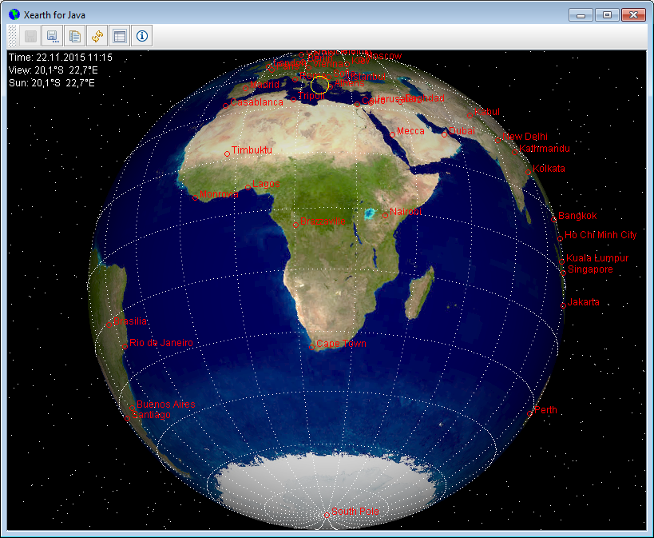
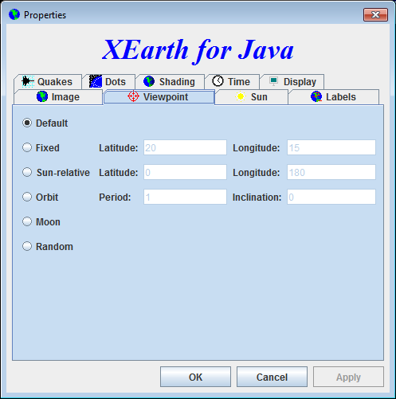

# XEarth for Java

### What is XEarth?
XEarth renders a shaded image of the earth, as seen from your favorite
vantage point in space. By default, the image is updated every five minutes
according to the current position of the sun.

### Configuration

The image is highly configurable.

### Build

	mvn clean install
   
  then check the `target` directory to find the generated jar file.
     
### Acknowledgements
- [xearth for Windows](http://www.hewgill.com/xearth/) by Greg Hewgill
- [xearth for Unix](http://www.rpmfind.net/linux/rpm2html/search.php?query=xearth) by Kirk Lauritz Johnson
- [Visible Earth, Blue Marble](http://visibleearth.nasa.gov/view.php?id=57730) by NASA
- [Astronomische Algorithmen](http://www.amazon.de/Astronomische-Algorithmen-Jean-Meeus/dp/3335004000) by  Jean Meeus
- [Earthquakes Real-time Feeds](http://earthquake.usgs.gov/earthquakes/feed/v1.0/csv.php) by USGS
